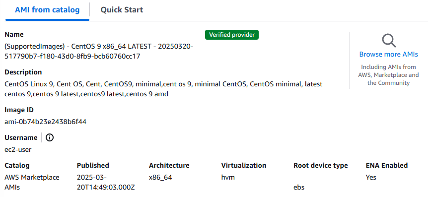
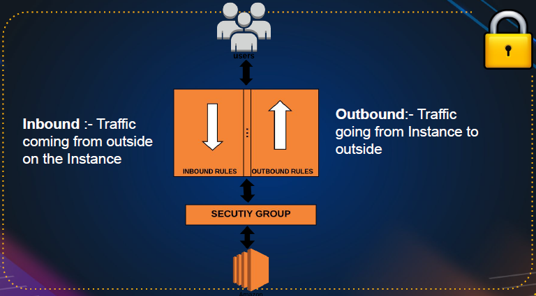
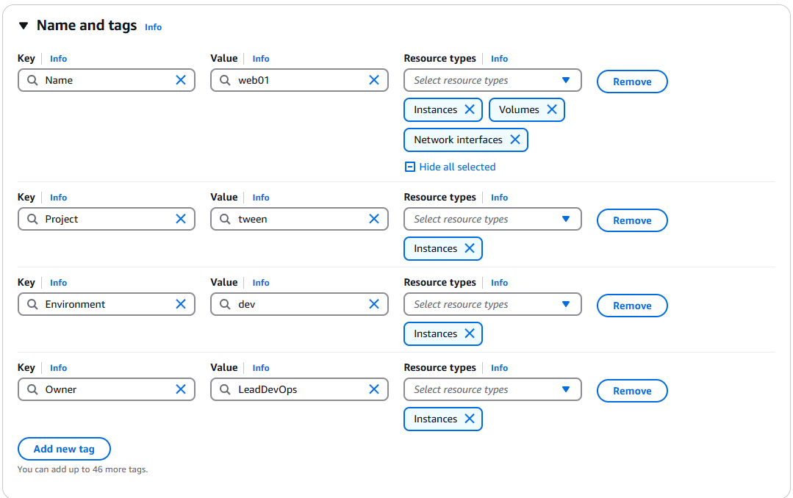

# EC2 Instances

## 1. Launching Your First EC2 Instance on AWS (Step-by-Step)

In this section, we’ll walk through how to launch your first EC2 instance using the AWS Management Console. An EC2 instance is essentially a virtual server in the cloud, and AWS makes it easy to get started—even with the free tier.

To begin, log in to your AWS account and choose the **North Virginia (US East 1)** region. This region is generally cost-effective, even for free tier users, and helps avoid potential pricing surprises in other areas.

Head over to the EC2 service by either searching for it in the Services menu or selecting it from the list. You’ll land on the EC2 Dashboard, which displays your current instances, volumes, and more. Note: this dashboard does **not auto-refresh**, so make sure to refresh it manually to see updated stats.

### Launching the Instance

Click on **“Launch Instance”**, and let’s configure it step-by-step:

1. **Name and Tags**: Give your instance a name like `web01`. Tags are useful for organization—add key-value pairs like `project: alpha` as needed.

2. **Choose an AMI (Amazon Machine Image)**: You'll see options like Amazon Linux, Ubuntu, and CentOS. Be cautious—some AMIs, especially from the AWS Marketplace or third-party vendors like CIS or OpenVPN, might incur extra costs. For this tutorial, select **CentOS 9 (free)** from AWS Marketplace AMIs, ideally one listed as supported by "Supported Images".


After selection, it will show pricing but it is for t3 tier, but we will be using t2 free tier. Subscribe it. It will show username: `ec2-user`.



3. **Instance Type**: Select **t2.micro**, which is free-tier eligible and offers 1 CPU and 1GB RAM—sufficient for basic setups. AWS offers various instance families (T-series for general use, C-series for compute-optimized workloads, etc.), so you can explore more later based on your needs. See more [here](https://aws.amazon.com/ec2/instance-types/).

4. **Key Pair**: Since there's no default username/password, create a new SSH key pair of type `RSA` (e.g., `web-key-dev`). Choose the `.pem` format unless you’re using PuTTY (which requires PPK). Save the `.pem` file to your local machine at secure location for future use.

5. **Security Group (Firewall)**: In the **Network Settings** section, Every EC2 instance is protected by a security group. Rename it appropriately (e.g., `web-sg`) and see the default inbound rules:

   - **SSH (port 22)**: Allow from your IP.
   - **HTTP (port 80)**: Allow from your IP or from anywhere (for public web access).

   Add additional inbound rules as needed. You can also find Subnet, which is where the instance is deployed. By default it is "No Preference" and it will be in the same subnet as the VPC. But you select one as needed.

6. **Configure Storage**: Stick with the default 10GB unless you need more. This is managed via Amazon EBS, which we'll explore in another session.

7. **Advance Details => User Data (Optional Provisioning)**: Under Advanced Details, you can add a shell script to run on boot. For example:

   ```bash
   #!/bin/bash
   sudo yum install -y httpd
   sudo systemctl start httpd
   sudo systemctl enable httpd
   mkdir /tmp/test1
   ```

   This sets up a basic Apache web server.

Click **Launch Instance**, and AWS will handle the provisioning. It may take a moment, especially if the AMI is still being subscribed to.

### Connecting to the Instance

Once your instance is running:

- Go to the instance’s details and click **Connect**.
- Use the SSH client option. The command format will be:

  ```bash
  ssh -i ~/Downloads/web-key-dev.pem ec2-user@<public-ip>
  ```

  

- If you get a "Permission denied" error, ensure you're pointing to the correct file path and that your `.pem` file has appropriate permissions (`chmod 400` if needed).

### Verifying Setup

After connecting:

- Switch to root (`sudo su`) and check the status of the HTTP service with `systemctl status httpd`.
- You can also verify the open ports with:

  ```bash
  ss -tunlp | grep 80
  ```

  ```bash
  curl http://localhost
  ```

Access the public IP in your browser using `http://<public-ip>`. If the page doesn’t load, ensure your security group allows inbound traffic on port 80 (Modify inbound rules).


### Cleanup

After verifying everything, **terminate the instance** to avoid unnecessary charges:

- Go to **Instance State > Terminate Instance**.

In the next section, we’ll explore more EC2 features and dive deeper into networking and storage.

---

## 2.0. Best Practices Before Launching an EC2 Instance

Before you dive into launching an EC2 instance, it’s crucial to follow some foundational best practices. These practices not only help in setting up your infrastructure efficiently but also ensure smoother management down the line.

### 1. **Gather Requirements**

Start by understanding _why_ you need the EC2 instance. What is its purpose? Whether it’s for hosting a web server, database, or a development environment, you should define:

- **Operating System** – Determines the AMI to choose (e.g., Ubuntu, Amazon Linux).
- **Instance Type** – Based on CPU, RAM, and network requirements.
- **Storage Needs** – Consider both OS and application storage.
- **Environment** – Development, staging, or production? This influences configurations and tagging.
- **Services** – What services (e.g., SSH, HTTP, MySQL) will be running?
- **Tags** – Use tags for name, project, environment, and owner to make resource management easier.

### 2. **Create a Key Pair**

Although you can create a key pair during instance launch, it’s a good practice to set it up beforehand. Use clear naming conventions such as `project-env-region.pem` (e.g., `tween-dev-us-east-1.pem`) for better organization. Remember, the public key is injected into the instance, and the private key is used for SSH access.

### 3. **Configure a Security Group**

Security groups act as virtual firewalls. It’s better to define one ahead of time with only the necessary inbound rules. For example:

- Allow **SSH (port 22)** from your IP only.
- Add **HTTP (port 80)** for web access when hosting a website.

Avoid overly permissive rules like “All traffic from anywhere” unless absolutely necessary. Keep outbound rules as default unless specified otherwise.

- Security groups are applied to instances, volumes, and even network interfaces.
- Firewall is a network security system that monitors and controls incoming and outgoing network traffic. Think of it as a watchman (gatekeeper), who has a register and from the register he can check who is allowed to come inside or go outside and from where they are coming.
- They are stateful.
- There are two types of rules in security groups: inbound rules and outbound rules.



### 4. **Tagging for Better Management**

Tags are not just for naming; they’re powerful tools for filtering, auditing, and managing resources. Common tags include:

- `Name`: e.g., `web-01`
- `Project`: e.g., `tween`
- `Environment`: e.g., `dev`, `prod`
- `Owner`: Person or team responsible

These tags apply to instances, volumes, and even network interfaces.

### 5. **Launch Your Instance**

Once everything is in place:

- Choose your AMI (e.g., Ubuntu 20.04 for free tier).
- Select your instance type (e.g., `t2.micro`).
- Attach your pre-created key pair and security group.
- Apply your tags.
- Launch the instance.

### 6. **Verify and Connect**

After launch, verify that the instance is running. Use the `ssh -i` command with your private key and instance public IP to connect. If hosting a website, ensure port 80 is open and accessible in your security group settings.

By following this structured approach, you'll avoid common missteps and ensure your EC2 instances are secure, manageable, and aligned with your project needs. Would you like a visual checklist for this process?

---

## 2.1. Steps to Deploy a Website on an EC2 Instance

### **1. Requirement Gathering**

Before launching the instance, the following requirements were identified:

- **Project Name**: Twin
- **Environment**: Development (dev)
- **OS**: Ubuntu 20.04
- **Instance Type**: t2.micro (Free Tier)
- **Storage**: 8 GB (default)
- **Tags**: Name, Project, Environment, Owner
- **Key Pair**: Created with naming format `tween-dev-region.pem`
- **Security Group**: Custom SG allowing only SSH from current IP

### **2. Key Pair Setup**

- Navigated to EC2 > Key Pairs
- Deleted old key pairs
- Created a new key pair:

  - Name: `tween-dev-north-virginia`
  - Key Type: `RSA`
  - Format: `.pem`
  - Downloaded the private key

### **3. Security Group Setup**

- Navigated to EC2 > Security Groups
- Deleted old security group except for `default` (after removing dependent network interfaces)
- Created a new security group:

  - Name: `tween-web-dev-sg`
  - Inbound rule: Allow SSH (port 22) from _My IP_
  - Initially, no HTTP (port 80) rule. We will modify it later.
  - Don't touch outbound rules

  

### **4. EC2 Instance Launch**

- Added Tags:
  - Name: `web01`
  - Project: `tween`
  - Environment: `dev`
  - Owner: e.g., `LeadDevOps`



- Chose **Ubuntu 24.04** AMI (free)
- Selected **t2.micro** instance
- Attached:

  - **Key Pair**: `tween-dev-region`
  - **Security Group** (in network settings): `tween-web-dev-sg`

- User data (provisioning) is not required, will do it manually.
- Launched the instance

### **5. SSH into the Instance**

- Select the instance and click **Connect**. Choose SSH Client.
- Used Git Bash or Terminal:

  ```bash
  ssh -i ~/Downloads/tween-dev-north-virginia.pem ubuntu@<public-ip>
  ```

### **6. Website Setup (from Tooplate Template)**

- Gained root access:

  ```bash
  sudo -i
  ```

- Installed Apache and copied website files (from Tooplate.com template):

  - Website template used: **Twin Agency**
  - All relevant commands were reused from a previous Linux session

  ```bash
  sudo apt update
  sudo apt install apache2 wget unzip -y
  wget https://www.tooplate.com/zip-templates/2128_tween_agency.zip
  unzip 2128_tween_agency.zip
  sudo cp -r 2128_tween_agency/* /var/www/html/
  sudo systemctl restart apache2
  ```

- Verified files in:

  ```bash
  ll /var/www/html
  ```

### **7. Apache Web Server Check**

- Checked Apache status:

  ```bash
  systemctl status apache2
  ```

### **8. Add HTTP Access**

- If you try to access the public IP in your browser, it won't work because port 80 is closed. You need to open port 80 in your security group.
- Returned to EC2 > Security Group > Edit Inbound Rules
- Added:

  - **HTTP (port 80)** from _My IP_

- Saved changes

### **9. Verify Website**

- Accessed site in browser:

  ```
  http://<instance-public-ip>
  ```

- Website loaded successfully from port 80

---

## 3. Managing Public and Elastic IPs, Instance Settings, and Cleanup in EC2

Before shutting down your EC2 instance, it’s important to understand how AWS handles IP addresses and resources tied to that instance. Start by noting both the **public** and **private IPs** assigned to your running instance. When you **stop** an EC2 instance (not reboot it), the public IP address is released back to AWS’s IP pool — meaning the next time you start the instance, it will likely be assigned a **different public IP**. However, the **private IP remains persistent**, ensuring internal communication in your VPC remains unaffected.

If you need a **static public IP** that persists even after stopping and starting the instance, AWS offers **Elastic IPs**. These are reserved public IPs that remain yours until you release them. You can allocate an Elastic IP, then associate it with your instance. Once assigned, this IP stays with your instance — even through stop/start cycles — and can also be reassigned to new instances if needed. Note: AWS provides up to **five Elastic IPs per region** by default, and you can request more if necessary.

After allocating the Elastic IP address, select the IP address => Actions => Associate Elastic IP Address => Choose instance => Associate. Now check the instance details to verify the Elastic IP is associated. Powering off the instance doesn’t affect the Elastic IP.

It’s also useful to explore EC2 instance settings. For example, to **change the instance type** (Actions => Instance Settings => Change Instance Type), such as upgrading from a `t2.micro` to a `t2.small`, you must first stop the instance. After changing the type, restarting the instance activates the new configuration. This is handy when scaling or testing performance, and costs for short use are minimal if you're within the free tier or using small instances temporarily.

Behind the scenes, stopping an EC2 instance doesn’t delete associated components like **network interfaces**, **volumes**, and **security groups**. All inbound rules and firewall configurations apply to the **network interface**, not the instance directly. All the firewall rules apply to the network interface, not the instance. You can also attach multiple interfaces if needed, although it's unnecessary for basic setups.

One instance can have multiple security groups.

Monitoring tools, like **system logs** (Actions => Instance Settings => View System Logs), can help you debug issues — especially if you're working with custom AMIs or instances that fail to boot properly. Logs may take a moment to populate after startup, so patience is key when reviewing boot diagnostics.

Finally, proper **resource cleanup** is crucial to avoid unnecessary charges. After finishing your work:

- **Terminate** your instance
- **Release** the Elastic IP to **save costs** and **avoid being billed for unused IPs**
- Optionally delete key pairs and security groups (although these incur no cost)

The EC2 dashboard gives a complete overview of your resources. With practice, you should be able to launch, configure, and manage EC2 instances confidently in minutes. Keep experimenting within the free tier, and remember to shut down and release resources when you're done.

---

## 4. Getting Started with AWS CLI: Install, Configure, and Explore

In this section, we’ll walk through the essentials of getting started with the **AWS Command Line Interface (CLI)**. While much of AWS can be managed through the console, the CLI is a powerful tool—especially for DevOps professionals—and allows you to automate and control your AWS environment efficiently using command-line commands.

### Installing AWS CLI

To begin, make sure AWS CLI is installed on your machine:

- **Windows** users can run `choco install awscli` via PowerShell as an administrator.
- **Linux** users can install it using `apt install awscli` or `yum install awscli`.
- **macOS** users can use `brew install awscli`.

Alternatively, you can refer to the [official AWS installation guide](https://docs.aws.amazon.com/cli/latest/userguide/install-cliv2.html) for platform-specific instructions if you prefer not to use package managers.

Once installed, verify it with:

```bash
aws --version
```

### Configuring AWS CLI

To use AWS CLI, you need to authenticate using an **IAM user** with appropriate permissions:

1. Go to the IAM section in your AWS Console.
2. Create a new user like `awscli` (CLI access only, no console access required).
3. Attach the **AdministratorAccess** policy (in "Attach policies directly") if you're managing all AWS resources yourself. If it's for limited use, assign the appropriate policy.
4. Create User.
5. Go to **Security Credentials** and Create an **Access Key** and **Secret Access Key** (Choose 1st option => CLI). Download the generated CSV file.
6. Save the credentials securely—**do not share or expose them**, especially in public repositories.

Now, configure the CLI:

```bash
aws configure
```

You'll be prompted to enter:

- Access key
- Secret access key
- Default region (e.g., `us-east-1`)
- Output format (`json` is recommended)

Your configuration details are saved in `~/.aws/config` and `~/.aws/credentials`.

```bash
$ cat ~/.aws/config
[default]
region = us-east-1
output = json

$ cat ~/.aws/credentials
[default]
aws_access_key_id = ...
aws_secret_access_key = ....
```

### Running Basic AWS CLI Commands

Once set up, you can verify your identity:

```bash
aws sts get-caller-identity
```

To list EC2 instances:

```bash
aws ec2 describe-instances
```

This returns a JSON output detailing your EC2 resources.

### Finding AWS CLI Commands

You don’t need to memorize commands. There are several helpful resources:

- **[AWS CLI Command Reference](https://docs.aws.amazon.com/cli/latest/index.html)**: Official documentation for all services and commands.
- **ChatGPT**: You can describe what you want (e.g., “Create key pair, security group with port 22, and launch EC2 instance in us-east-1”) and get step-by-step CLI commands.
- **PDF Cheat Sheets**: Many courses and tutorials offer downloadable cheat sheets with ready-to-use CLI examples for common tasks.

For example, to launch an EC2 instance:

```bash
# Not Working image-id
aws ec2 run-instances \
  --image-id ami-00dfe2c7ce89a450b \
  --count 1 \
  --instance-type t2.micro \
  --key-name tween-dev-north-virginia \
  --security-groups tween-web-dev-sg
```

Replace the AMI ID with one valid for your region. You can find this from the EC2 launch wizard in the AWS Console.

### Best Practices and Final Tips

- Explore the CLI by trying to replicate your console tasks.
- Always clean up resources after use to avoid charges.
- Store access credentials securely and rotate them regularly.
- Avoid hardcoding credentials in code or scripts.

The CLI is a core skill for working with AWS efficiently. By combining hands-on practice with the CLI documentation and tools like ChatGPT, you'll build confidence and gain a deeper understanding of AWS operations.

---
