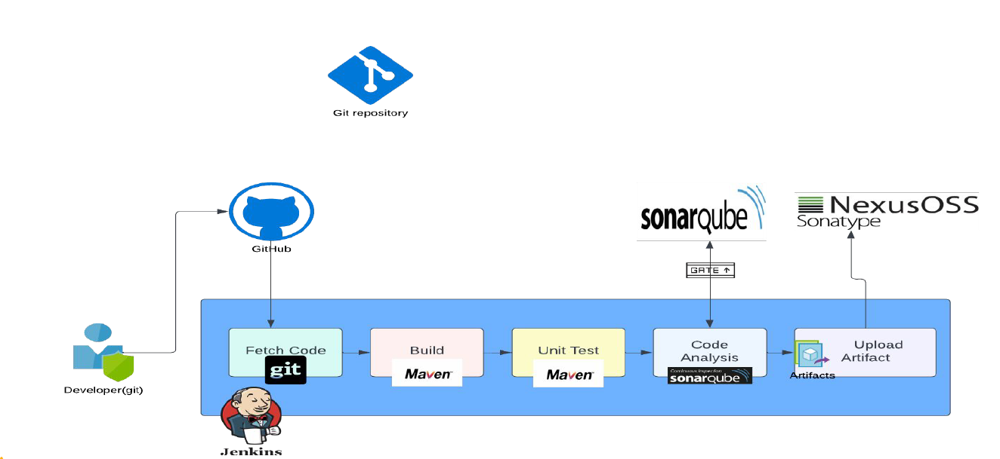

# Jenkins Pipeline: A Hands-On Introduction

## 1. 🔁 Understanding the Continuous Integration Pipeline Flow

Hello and welcome! 👋 In this session, we’re going to break down the **Continuous Integration (CI) pipeline** that we’ll be setting up over the next few videos. Before jumping into implementation, it’s crucial to **understand the flow** – how code travels from development to deployment-ready artifacts. 🛠️

We're focusing on a set of tools to demonstrate this CI pipeline:

- 🧰 **Jenkins** (for orchestration)
- 🧠 **Git** (for version control)
- 🏗️ **Maven** (for building Java projects)
- 🧪 **SonarQube** and **Checkstyle** (for code quality and analysis)
- 📦 **Nexus** (for artifact storage)

These tools are just examples. Your actual project might use different ones, but the **core flow remains the same** – so grasp the concept, and you’ll be able to apply it with any toolset. 💡

### 👨‍💻 The Developer's Role

The journey begins with the **developer** writing and testing code locally. Once confident, they **push the code to a GitHub repository**. This is the centralized source from where the pipeline kicks off.

### ⚙️ Jenkins Triggers the Pipeline

Jenkins is configured with Git plugins that detect code changes. As soon as a commit is made, Jenkins:

1. 📥 **Fetches the latest code** using Git.
2. 🧱 **Builds the project** using Maven (in our case, for Java – but it can be adapted to other languages and tools).

### ✅ Testing and Code Quality Checks

After building the code, Jenkins runs **unit tests** using Maven's testing frameworks. These tests verify that each piece of functionality works as expected. The output is usually in XML format – ready for reporting.

Next comes **code analysis** 🕵️. Tools like SonarQube and Checkstyle assess:

- Bugs 🐞
- Vulnerabilities 🔐
- Coding standards 🧹
- Code smells and maintainability 💭

These tools generate detailed reports and dashboards. You can even enforce **quality gates** in SonarQube – if the code doesn’t meet the criteria, the build fails and the pipeline stops 🚫.

### 📦 Artifact Creation and Distribution

If everything passes, Jenkins proceeds to **version the artifact** and upload it to a **Nexus repository**. This versioned artifact is now ready for deployment to any environment. 🌍

### 🔁 Tool Agnostic Flow

Even though we’re using Jenkins, GitHub, SonarQube, and Nexus here, you can replicate the same pipeline with other CI tools like:

- 🧪 GitLab CI
- 🌀 CircleCI
- 🎍 Bamboo
- And many others!

The flow remains: **Fetch → Build → Test → Analyze → Publish**.

### 🎬 What’s Next?

In the next video, we’ll start implementing this CI pipeline step by step. For now, take a moment to review the flow. Once you're confident with it, join me in the next video and let's bring this pipeline to life! 🚀
